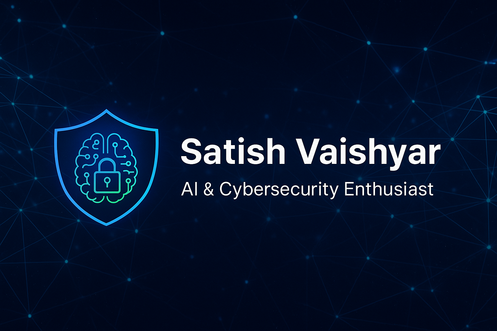

<!-- Banner -->

<h1 align="center">👋 Hey, I’m Satish Vaishyar</h1>
<h3 align="center">AI & Cybersecurity Enthusiast | Turning Data Into Defense</h3>

---

### 🚀 About Me
I thrive at the intersection of **Artificial Intelligence** and **Cybersecurity**, building intelligent systems that not only learn — but protect.  
Passionate about problem-solving, innovation, and creating tech that makes an impact.

---

### 🛠 Tech Stack
**Languages:** Python  
**AI/ML:** TensorFlow, PyTorch, Scikit-learn, OpenCV  
**Cybersecurity:** Wireshark, Nmap, Burp Suite, Metasploit  
**Data Tools:** Pandas, NumPy, Matplotlib, Seaborn  
**Other:** Git, Docker, REST APIs

---

### 🌐 Connect with Me
  
  

---

### 📊 GitHub Stats
  

---
>_
⭐ **"Building the future, one line of code at a time."**  
💬 *"In a connected world, intelligence without security is a risk — and security without intelligence is blind."*

<!---
Satish-vaishyar/Satish-vaishyar is a ✨ special ✨ repository because its `README.md` (this file) appears on your GitHub profile.
You can click the Preview link to take a look at your changes.
--->
